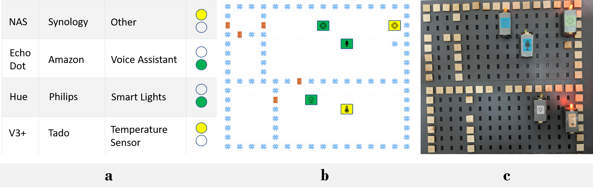

# SaferHome: Interactive Physical and Digital Smart Home Dashboards for Communicating Privacy Assessments to Owners and Bystanders
This repository contains the application code of SaferHome cloud and hardware applications.

## Paper Abstract
Private homes are increasingly becoming smart spaces. While smart homes promise comfort, they expose most intimate spaces to security and privacy risks. Unfortunately, most users today are not equipped with the right tools to assess the vulnerabilities or privacy practices of smart devices. Further, users might lose track of the devices installed in their homes or are unaware of devices placed by a partner or host. We developed SaferHome, an interactive digital-physical privacy framework, to provide smart home users with security and privacy assessments and a sense of device location. SaferHome includes a digital list view and physical and digital dashboards that map real floor plans. We evaluated SaferHome with eight households in the wild. We find that users adopted various strategies to integrate the dashboards into their understanding and interpretation of smart home privacy. We present implications for the design of future smart home privacy frameworks that are impacted by technical affinity, device types, device ownership, and tangibility of assessments.

This work can be cited as follows:
<pre>
@article{windl2022safer,
title = {SaferHome: Interactive Physical and Digital Smart Home Dashboards for Communicating Privacy Assessments to Owners and Bystanders},
author = {Maximiliane Windl and Alexander Hiesinger and Robin Welsch and Albrecht Schmidt and Sebastian S. Feger},
url = {},
doi = {10.1145/3567739},
year = {2022},
issue_date = {December 2022},
publisher = {Association for Computing Machinery},
address = {New York, NY, USA},
volume = {6},
number = {ISS},
journal = {Proc. ACM Hum.-Comput. Interact.},
month = {dec},
articleno = {586},
numpages = {18},
pubstate = {forthcoming}
}
</pre>
